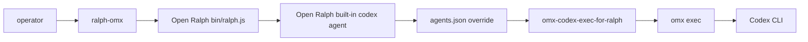

# Open Ralph via OMX (`ralph-omx`)

`ralph-omx` is a lightweight fork integration that preserves Open Ralph Wiggum's native iterative loop and swaps the Codex backend command to OMX.

## Architecture



Key point: the integration does not add a new Open Ralph agent type and does not patch Open Ralph core. It uses Open Ralph's existing `codex` agent slot plus the supported user config file `~/.config/open-ralph-wiggum/agents.json`.

## Quick start

```bash
cd /path/to/open-ralph-wiggum
bash contrib/omx/install.sh
RALPH_OMX_MODEL=gpt-5.5 \
OMX_RALPH_REASONING=high \
OMX_RALPH_SANDBOX=danger-full-access \
ralph-omx \
  --min-iterations 1 \
  --max-iterations 20 \
  --completion-promise YOUR_COMPLETION_PROMISE \
  --prompt-file .omx/prompts/your-task.md
```

Open Ralph still owns iteration limits, promises, task handling, stream parsing, session state, and commit behavior. OMX owns the Codex execution command that runs each iteration.

## Parameter guidance

- `--min-iterations N`: minimum loop count before completion can stop the run.
- `--max-iterations N`: safety cap for the Open Ralph loop.
- `--completion-promise TEXT`: stop phrase/promise that must appear when the task is truly done.
- `--prompt-file PATH`: long prompt file for copy-paste-safe commands.
- `--no-commit`: optional review-before-commit mode. Do not add it if you want Open Ralph's default auto-commit behavior.
- `--no-stream`: buffer agent output instead of streaming.
- `--no-questions`: prevent interactive question handling from stopping the loop.
- `--`: pass remaining flags to the backend command after Open Ralph arguments.

Environment defaults:

```bash
RALPH_OMX_MODEL=gpt-5.5
OMX_RALPH_REASONING=high
OMX_RALPH_SANDBOX=danger-full-access
```

## Install and update

```bash
bash contrib/omx/install.sh --dry-run
bash contrib/omx/install.sh
```

The installer writes:

- `~/.local/bin/ralph-omx`
- `~/.local/bin/omx-codex-exec-for-ralph`
- `~/.config/open-ralph-wiggum/agents.json` unless one already exists
- `~/.config/open-ralph-wiggum/omx.env` with `RALPH_OPEN_BIN` for copied-wrapper installs

Use `--force-config` only when you intentionally want to replace the Open Ralph agents config; the installer backs up the old file first.

## Verification

Local:

```bash
bash contrib/omx/test-smoke.sh
RALPH_OMX_SHIM_DEBUG=1 ralph-omx --help | head -80
```

Remote `mac32`:

```bash
bash contrib/omx/validate-mac32.sh mac32
```

If `mac32` has no checkout yet:

```bash
ssh mac32 'mkdir -p ~/src && cd ~/src && git clone --branch lqy/ralph-omx-integration https://github.com/liu-qingyuan/open-ralph-wiggum.git open-ralph-wiggum-omx-smoke'
```

Then rerun the validation script.

## Maintenance boundary

Keep the fork delta isolated to `contrib/omx/` and docs unless a future plan explicitly approves Open Ralph core changes. That keeps upstream rebases low-conflict and makes it obvious which files belong to the OMX integration.
