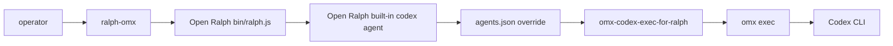

# Open Ralph via OMX (`ralph-omx`)

`ralph-omx` is a lightweight fork integration that preserves Open Ralph Wiggum's native iterative loop and swaps the Codex backend command to OMX.

## Architecture



Key point: the integration does not add a new Open Ralph agent type and does not patch Open Ralph core. It uses Open Ralph's existing `codex` agent slot plus the supported user config file `~/.config/open-ralph-wiggum/agents.json`.

## Quick start

```bash
cd /path/to/open-ralph-wiggum
bash contrib/omx/install.sh
RALPH_OMX_MODEL=gpt-5.5 \
OMX_RALPH_REASONING=high \
OMX_RALPH_SANDBOX=danger-full-access \
ralph-omx \
  --min-iterations 1 \
  --max-iterations 20 \
  --completion-promise YOUR_COMPLETION_PROMISE \
  --prompt-file .omx/prompts/your-task.md
```

Open Ralph still owns iteration limits, promises, task handling, stream parsing, session state, and commit behavior. OMX owns the Codex execution command that runs each iteration.

## Codex goal mode through OMX

Use `--codex-goal --codex-backend omx` when you want this shape:

```text
Open Ralph outer loop
  -> omx exec
  -> Codex CLI /goal
  -> one fresh process/session per Ralph iteration
```

In this mode Open Ralph does **not** rely on a previous Codex thread for cross-iteration memory. The final prompt passed to `omx exec` starts with `/goal`; the normal Ralph iteration prompt is embedded inside that goal objective. Cross-iteration state remains repo-native: git diff/history, `.harness/progress.md`, `.ralph/ralph-history.json`, `.ralph/codex-goal-ledger.jsonl`, and any project-specific logs.

```bash
RALPH_CODEX_GOAL=1 RALPH_CODEX_BACKEND=omx \
ralph \
  "Complete the task in .harness/goal.md. Run .harness/checks.sh. Output <promise>COMPLETE</promise> when everything passes." \
  --agent codex \
  --max-iterations 5
```

Or with flags only:

```bash
ralph \
  "Complete the task in .harness/goal.md. Run .harness/checks.sh. Output <promise>COMPLETE</promise> when everything passes." \
  --agent codex \
  --codex-goal \
  --codex-backend omx \
  --max-iterations 5
```

Ralph logs whether native `/goal` is being attempted and records `promptStartsWithGoal:true` in `.ralph/codex-goal-ledger.jsonl`. OMX/Codex output is still checked for goal-state evidence; if it is not present, Ralph warns instead of silently claiming native confirmation.

## Task Ledger minimum iterations

Use `--task-min-iterations N` with `--tasks` when each top-level todo should receive repeated Ralph implementation/verification pressure. This is different from `--min-iterations`: global `--min-iterations` gates the whole run, while `--task-min-iterations` gates each task in `.ralph/ralph-tasks.md`.

```bash
ralph-omx \
  --tasks \
  --task-promise READY_FOR_NEXT_TASK \
  --task-min-iterations 3 \
  --codex-goal \
  --codex-backend omx \
  --min-iterations 3 \
  --max-iterations 20 \
  --completion-promise FEATURE_VERIFIED \
  --prompt-file .omx/prompts/feature-ralph-omx.md
```

If a task is marked `[x]` before its minimum count is reached, Ralph keeps selecting that task for additional verification rounds instead of advancing. Custom prompt templates can embed the same gate using `{{task_gate_instruction}}` plus `{{task_attempt}}` / `{{task_min_required}}`.

## Post-run cleanup gate for OMX handoffs

For implementation-heavy Ralph/OMX runs, treat cleanup as a separate final quality gate after Ralph finishes rather than as part of the `ralph-omx` command itself:

1. Run the targeted verification commands for the Ralph objective.
2. Capture the files owned by the just-finished Ralph run from git status/diff and `.ralph/ralph-history.json`.
3. Run an OMX cleanup pass such as `$ai-slop-cleaner` on those changed files only; if there are no relevant edits, record a passed/no-op cleanup report.
4. Rerun verification after cleanup.
5. For substantial code changes, run a final review pass and resolve blockers before claiming the handoff is done.

Keep cleanup scoped to Ralph-owned changed files. Do not use a broad cleanup pass that can touch unrelated dirty work in the repository.

## Parameter guidance

- `--min-iterations N`: minimum outer Ralph loop count before final completion can stop the whole run.
- `--task-min-iterations N`: Tasks Mode only; each top-level `.ralph/ralph-tasks.md` item must receive N Ralph iterations before task/final completion is accepted. Per-task counts are stored in `.ralph/ralph-task-runs.json`.
- `--max-iterations N`: safety cap for the Open Ralph loop.
- `--completion-promise TEXT`: stop phrase/promise that must appear when the task is truly done.
- `--prompt-file PATH`: long prompt file for copy-paste-safe commands.
- `--codex-goal`: opt into Codex goal-mode prompting for the `codex` agent.
- `--codex-backend omx`: send the goal-mode iteration through `omx exec` instead of bare `codex exec`.
- `--no-commit`: optional review-before-commit mode. Do not add it if you want Open Ralph's default auto-commit behavior.
- `--no-stream`: buffer agent output instead of streaming.
- `--no-questions`: prevent interactive question handling from stopping the loop.
- `--`: pass remaining flags to the backend command after Open Ralph arguments.

Environment defaults:

```bash
RALPH_OMX_MODEL=gpt-5.5
OMX_RALPH_REASONING=high
OMX_RALPH_SANDBOX=danger-full-access
```

## Install and update

```bash
bash contrib/omx/install.sh --dry-run
bash contrib/omx/install.sh
```

The installer writes:

- `~/.local/bin/ralph-omx`
- `~/.local/bin/omx-codex-exec-for-ralph`
- `~/.config/open-ralph-wiggum/agents.json` unless one already exists
- `~/.config/open-ralph-wiggum/omx.env` with `RALPH_OPEN_BIN` for copied-wrapper installs

Use `--force-config` only when you intentionally want to replace the Open Ralph agents config; the installer backs up the old file first.

## Verification

```bash
bash contrib/omx/test-smoke.sh
RALPH_OMX_SHIM_DEBUG=1 ralph-omx --help | head -80
```

## Maintenance boundary

Keep the fork delta isolated to `contrib/omx/` and docs unless a future plan explicitly approves Open Ralph core changes. That keeps upstream rebases low-conflict and makes it obvious which files belong to the OMX integration.
